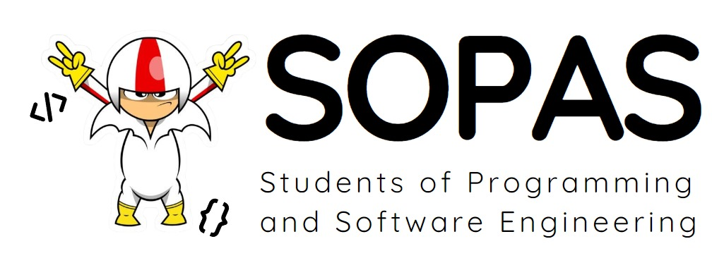

# Team: Students Of Programing And Software (SOPAS)

# Integrantes:

- Ricardo Andres Chamorro Martinez - A00399846
- Oscar Stiven Muñoz Ramirez - A00399922
- Diego Armando Polanco Lozano - A00399926
- Luis Manuel Rojas Correa - A00399289

## Tarea Integradora 2
**Objetivos Terminales**

Objetivos Terminales
OT1. Aplicar el paradigma funcional en el análisis, diseño, evaluación, selección e implementación de algoritmos para dar solución a problemas cuya estructura es naturalmente autocontenida.
OT3. Aplicar conceptos fundamentales de la teoría de números en el análisis de problemas computacionales que lo requieran, y . analizar relaciones binarias, en particular,  aquellas que forman una relación de equivalencia o relación de orden y aplicar este concepto a la solución de problemas.
OT4. Expresar o comunicar con el vocabulario y lenguaje adecuado/especializado las ideas principales sobre estructuras discretas o la programación funcional.

[**Link al enunciado**](https://docs.google.com/document/d/14JzjEBc079L0GOjIsGlpNOyqZuj_5wyM/edit)

